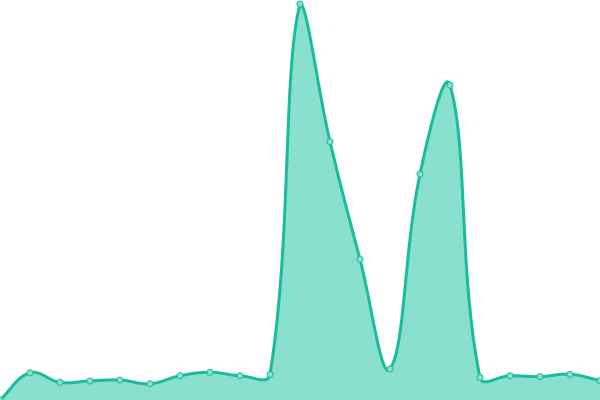
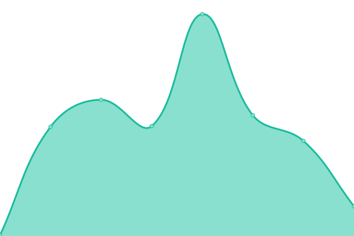

# [📈 Live Status](https://status.slawuwc.org): <!--live status--> **🟥 Complete outage**

This repository contains the open-source uptime monitor and status page for [Student-Led Activities Wiki](https://slawuwc.org), powered by [Upptime](https://github.com/upptime/upptime).

With [Upptime](https://upptime.js.org), you can get your own unlimited and free uptime monitor and status page, powered entirely by a GitHub repository. We use [Issues](https://github.com/slawuwc/slaw-status/issues) as incident reports, [Actions](https://github.com/slawuwc/slaw-status/actions) as uptime monitors, and [Pages](https://status.slawuwc.org) for the status page.

<!--start: status pages-->
<!-- This summary is generated by Upptime (https://github.com/upptime/upptime) -->
<!-- Do not edit this manually, your changes will be overwritten -->
<!-- prettier-ignore -->
| URL | Status | History | Response Time | Uptime |
| --- | ------ | ------- | ------------- | ------ |
|  [SLAW Main Site](https://slawuwc.org) | 🟥 Down | [slaw-main-site.yml](https://github.com/slawuwc/slaw-status/commits/HEAD/history/slaw-main-site.yml) | 

 205ms
     
 | 

<a href="https://status.slawuwc.org/history/slaw-main-site">100.00%</a>
    

|  [SLAW Main Site (www)](https://www.slawuwc.org) | 🟥 Down | [slaw-main-site-www.yml](https://github.com/slawuwc/slaw-status/commits/HEAD/history/slaw-main-site-www.yml) | 

 236ms
     
 | 

<a href="https://status.slawuwc.org/history/slaw-main-site-www">100.00%</a>
    

|  [SLAW Discover](https://discover.slawuwc.org) | 🟥 Down | [slaw-discover.yml](https://github.com/slawuwc/slaw-status/commits/HEAD/history/slaw-discover.yml) | 

 272ms
     
 | 

<a href="https://status.slawuwc.org/history/slaw-discover">100.00%</a>
    

<!--end: status pages-->

[**Visit our status website →**](https://status.slawuwc.org)

## 📄 License

- Powered by: [Upptime](https://github.com/upptime/upptime)
- Code: [MIT](./LICENSE) © [Student-Led Activities Wiki](https://slawuwc.org)
- Data in the `./history` directory: [Open Database License](https://opendatacommons.org/licenses/odbl/1-0/)
